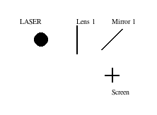

# UFOpticSim 
## What is it?
UFOpticSim is a Python3 module that can allow scientists to simulate how the properties of ultra fast laser pulses change under interaction with different optical elements. The main selling point of UFOpticSim is its simplicity, accuracy and its lightweightness.

The following information about the beam properties can currently be simulated:
| Temporal Properties | Spectral Properties | Spatial Properties | 
| -------- | ------- | ------- |
| Pulse Duration (FWHM) | Central Wavelength | Beam Waist |
| Chirp GDD | Bandwidth |  |

The following are the currently supported optical elements
| Optical Element | Supported yet | Not supported yet |
| -------- | -------- | -------- |
| Lens | ✅ |  |
| Mirrors | ✅ | |
| Gratings| |✅| 
|Prisms| | ✅|

## How does it work?
To get started, simply try the following code:
```python
from UFOpticSim import Simulation, Screen, PulseProfile, Laser, Lens, Mirror, Material

sim = Simulation(media='air', interval_cm=0.5)

pulse = PulseProfile(duration_fs=30, bandwidth_nm=45, is_temporally_limited=True, central_wavelength_nm=800, beam_waist_mm=0.5, m2=1)
laser = Laser(beam_profile=pulse, dir=(1, 0), pos_cm2=(1, 1))
glass = Material(media='BK7', thickness_mm=10)
lens = Lens(material=glass, focal_length_mm=100, pos_cm2=(2, 1), lens_name="Lens 1")
mirror = Mirror(material=glass, angle_to_horizontal=45, pos_cm2=(3, 1), mirror_name="Mirror 1")
screen = Screen(pos_cm2=(3, 2))

sim.add_laser(laser)
sim.add_element(mirror)
sim.add_element(lens)
sim.add_screen(screen)

sim.run(output=True, visualisation=True)
```

The visualisation tool:


The expected output printed on screen:
```
Input Pulse
-----------

1. Temporal Properties
        Pulse Duration (FWHM): 30 fs

2. Spectral Properties
        Central Wavelength: 800 nm
        Bandwidth: 45 nm

3. Spatial Properties


After Propagation
-----------------

1. Temporal Properties
        Pulse Duration (FWHM): 30.000214206532053 fs
        Chirp GDD = 899.9469622940074 fs^2

2. Spectral Properties
        Central Wavelength: 800 nm
        Bandwidth: 45 nm

3. Spatial Properties
        Beam Waist: 0.4751741561798651 mm
```
